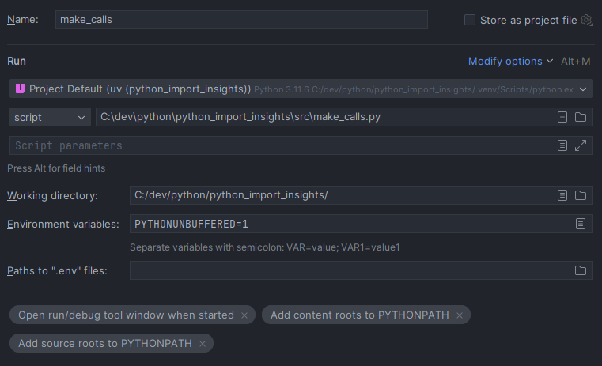
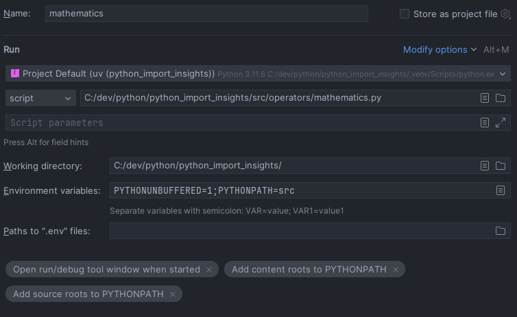
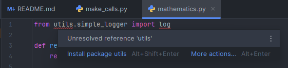
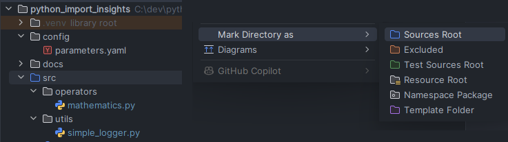

# Python import insights

## Table of contents
<!-- TOC -->
* [Python import insights](#python-import-insights)
  * [Table of contents](#table-of-contents)
  * [Purpose](#purpose)
  * [Basics](#basics)
    * [Current working directory](#current-working-directory)
    * [Modules, packages](#modules-packages)
    * [Script vs module execution](#script-vs-module-execution)
    * [Module search path](#module-search-path)
    * [Absolute vs relative imports](#absolute-vs-relative-imports)
  * [The pitfall](#the-pitfall)
  * [The solution (TL;DR)](#the-solution-tldr)
  * [The solution (detailed)](#the-solution-detailed)
    * [Project setup](#project-setup)
    * [The virtual environment](#the-virtual-environment)
    * [Verification of cwd and sys.path for this setup](#verification-of-cwd-and-syspath-for-this-setup)
    * [Reading files at project root level](#reading-files-at-project-root-level)
    * [Absolute imports and script execution mode](#absolute-imports-and-script-execution-mode)
    * [Testing](#testing)
    * [Running nested modules as scripts](#running-nested-modules-as-scripts)
    * [Pycharm IDE configuration](#pycharm-ide-configuration)
    * [VS Code IDE configuration](#vs-code-ide-configuration)
  * [Author](#author)
<!-- TOC -->

## Purpose
The purpose of this repo is to establish an ideal python project repository setup that covers the following desiderata:
- Execution works from command line, vs code, pycharm
- No tweaks to sys.path (codebase) or PYTHONPATH (environment) are required
- A src/ layout is used, with no code at the project root level
- Config files can be stored at the project root or in a config/ folder
- The pycharm IDE can resolve the imports correctly during code analysis
- Pytest works and can use imports relative to src/
- Modules in subfolders (packages) can also be executed as scripts
- A virtual environment can be created at the project root level

## The theory
To fully grasp the solution that covers these desiderata, we need to understand how python imports work at a deeper level.
- Understand the difference between cwd and sys.path
- Understand the differences between modules, files, packages and folders
- Understand how script vs module execution differ
- Understand how the module search path is constructed
- Understand absolute vs relative imports

### Current working directory
The current working directory (cwd) is the directory from which you started the python interpreter or script. 
It can be obtained using `os.getcwd()`.
It is important for python when resolving relative file paths.
It has no direct relation to imports.

### Modules, packages
A python **module** is a file containing python code. 
It can be imported using the `import` statement. 
It can also be executed as a script.

A python **package** is a way of grouping code in a folder. 
A package can contain modules and sub-packages. 
Two flavors exist. 
If the folder contains a `__init__.py` file it is called a regular package. 
Regular packages offer more control to the developer over what is exported when the package is imported.
If the folder does not contain a `__init__.py` file it is called a namespace package.
Since PEP 420, namespace packages behave just like regular packages. They offer a more lightweight way to create packages.

### Script vs module execution
Python can execute code in two ways: as a script or as a module. Imagine a folder structure like this:
```
    src/
        main.py
```
You can execute `main.py` as a script by running `python src/main.py` from the command line.  
You can execute `main.py` as a module by running `python -m src.main`.  
Both commands should be executed from the project root folder.

When executing as a module, the module's name is set to the module's file name.  
When executing as a script, the module's name is set to `__main__`.  
Hence, only when running a module as a script will code in the `__if __name__ == '__main__':`_ block be executed.

### Module search path
`sys.path` is a list of strings that specifies the search path for modules. 
When you call `import` in the Python interpreter searches through a set of directories for the name provided. 
The list of directories that it searches is stored in `sys.path`. 
It is populated as follows:
1. The directory containing the script being run (or the current directory if in interactive mode), note that:
   - **When running a module as a script the module's path is added to `sys.path`.**
   - **When running a module as a module, the current working directory is added to `sys.path`.**
2. Standard library paths 
3. Site-packages (third-party packages)
4. Any paths specified in the PYTHONPATH environment variable

Virtual environment work because they modify entries 2 and 3 of the `sys.path`.  
When you want to import modules from your project, the lookup will start at `sys.path[0]`.

### Absolute vs relative imports
Absolute imports specify the full path to the module or package you want to import, starting from any folder in `sys.path`.
Relative imports specify the path to the module or package you want to import relative to the current module's location.
Relative imports use dot notation to indicate the current and parent packages involved in the import.
It is recommended to use absolute imports for clarity and maintainability.

## The pitfall
To keep structure in your project, you want to separate data, configuration and source code files. 
There are [good reasons](https://packaging.python.org/en/latest/discussions/src-layout-vs-flat-layout/) to choose a src/ layout and without source code at the project root level.
However, once you make that decision, chances are your code only works in pycharm, but not from the command line or vs code.
Or the code works but your relative file paths start to fail.

The internet is filled with people suggesting:
- to modify `sys.path` in your code
- to modify the PYTHONPATH environment variable
- to tune your IDE run configuration
- to change your working directory

All of the above are bad ideas because, when not handled carefully, they make your code less portable, as it will only work in your specific setup.

## The solution (TL;DR)
- Create your virtual environment at the project root level 
- Create your IDE project (.idea or .vscode) at the project root level
- Create your git folder at the project root level
- Always run your code from the project root level
- Store config and data files in subfolders of the project root directly
- Access config and data files using relative file paths (relative to cwd)
- Always run your code using script execution mode (`python src/mymodule.py`)
- Use absolute imports relative to `src/` in your code and tests
- Tune the pytest configuration to add `src/` to `sys.path`
- Add `src/` to `sys.path` if you want to run nested modules as scripts
- Mark the `src/` folder in pycharm as "sources root"
- Tune your IDE run configuration to reflect the above settings

## The solution (detailed)
In this section we will explore the solution to the desiderata mentioned above.

### Project setup
The project structure (this repo) is as follows:
```
project_root/
├── src/
│   ├── operators/
│   │   └── mathematics.py
│   ├── utils/
│   │   └── simple_logger.py
│   ├── make_calls.py
│   ├── read_config.py
│   └── verify_path.py
├── tests/
│   └── test_all.py
├── pyproject.toml
└── uv.lock
```

### The virtual environment
In the proposed solution, the virtual environment is created at the project root level.
```
project_root/> uv sync
project_root/> .venv\Scripts\activate
(python_import_insights) project_root/>
```

### Verification of cwd and sys.path for this setup
To verify what is described above in the 'basics - module search path' section, the `verify_path.py` module is provided.
```python
# verify_path.py
import os
import sys 

if __name__ == '__main__':
    print("cwd: " + os.getcwd())
    print("sys.path[0]: " + sys.path[0])
```
This module in src/ can be executed as a script or as a module:
```commandline
(python_import_insights) C:\dev\python\python_import_insights>python src\verify_path.py
cwd: C:\dev\python\python_import_insights
sys.path[0]: C:\dev\python\python_import_insights\src

(python_import_insights) C:\dev\python\python_import_insights>python -m src.verify_path    
cwd: C:\dev\python\python_import_insights
sys.path[0]: C:\dev\python\python_import_insights
```
Note that 
- The cwd is determined by the folder from which the command is run (project root in this case).
- When running as a script, the module's path is added to `sys.path[0]`.

### Reading files at project root level
To achieve configuration, data, and code separation, you want to store config files at the project root level or in a config/ folder.
To read such files, you need to construct the file path relative to the cwd, not relative to the module file.
The `read_config.py` module demonstrates this:
```python
import os
import yaml

if __name__ == "__main__":
    file_path = os.path.join("config","parameters.yaml") # <-- relative file path
    if os.path.exists(file_path):
        with open(file_path, "r") as file:
            config = yaml.safe_load(file)
        print(config)
    else:
        print(f"File {file_path} does not exist.")
```

Running this module as a script or as a module works fine:

```commandline
(python_import_insights) C:\dev\python\python_import_insights>python src\read_config.py
{'parameter_one': 'value_one', 'parameter_two': 'value_two'}
```

**Anti-pattern:**  
While you can also cd into the `src/` folder and run modules from there (e.g. `verify_path.py`), this is an anti-pattern as it breaks relative file paths as demonstrated by rerunning `read_config.py`.

```commandline
(python_import_insights) C:\dev\python\python_import_insights\src>python verify_path.py
cwd: C:\dev\python\python_import_insights\src
sys.path[0]: C:\dev\python\python_import_insights\src

(python_import_insights) C:\dev\python\python_import_insights\src>python read_config.py
File config\parameters.yaml does not exist.
```

### Absolute imports and script execution mode
For the sake of brevity and maintainabilty (e.g. renaming package folders), the `src.` prefix should be avoided in all imports.
Note how the cross-cutting concern (logging) is implemented in a separate package and imported using absolute imports.
Using relative imports would be a nightmare to maintain.
```python
# make_calls.py
from operators.mathematics import add, return_math

def return_main():
    return "main"

if __name__ == '__main__':
    print(f"calling main: {return_main()}")
    print(f"calling math: {return_math()}")
    print(f"making a sum: {add(10,10)}")

# operators/mathematics.py
from utils.simple_logger import log

def return_math():
    return "math"

def add(a, b):
    log(f"adding {a} + {b}")
    return a + b

# utils/simple_logger.py
def log(s):
    print(f"log: {s}")
```
The above code works fine when `make_calls.py` is executed as a script because `sys.path[0]` refers to the `src\` folder.
```commandline
(python_import_insights) C:\dev\python\python_import_insights>python src\make_calls.py
calling main: main
calling math: math
log: adding 10 + 10
making a sum: 20
```
Yet it fails (ModuleNotFoundError) when executed as a module because of the `src.` prefix missing in the imports:
```commandline
(python_import_insights) C:\dev\python\python_import_insights>python -m src.make_calls    
Traceback (most recent call last):
  File "<frozen runpy>", line 198, in _run_module_as_main
  File "<frozen runpy>", line 88, in _run_code
  File "C:\dev\python\python_import_insights\src\make_calls.py", line 1, in <module>
    from operators.mathematics import add, return_math
ModuleNotFoundError: No module named 'operators'
```

### Testing
Your tests should live outside the `src/` folder. 
Again, for improved maintainability, imports in your tests should be absolute and relative to `src/`. 
This way, code written in `__name__ == "__main__"` blocks or entered in the debug interpreter can be tranferred to a test module, without having to redo all the imports.
The `tests/test_all.py` module demonstrates this:
```python
from make_calls import return_main
from operators.mathematics import return_math, add

def test_return_main():
    assert return_main() == "main"

def test_return_math():
    assert return_math() == "math"

def test_add():
    assert add(2, 3) == 5
    assert add(-1, 1) == 0
    assert add(0, 0) == 0
```
However, when we test this using pytest, it fails (ModuleNotFoundError) because `src/` is not on `sys.path`. 
```commandline
(python_import_insights) C:\dev\python\python_import_insights>pytest
==================================== test session starts =====================================
platform win32 -- Python 3.11.6, pytest-8.4.2, pluggy-1.6.0
rootdir: C:\dev\python
configfile: pytest.ini
collected 0 items / 1 error                                                                                                                                                                                                                                                                                                                                                                                                      

=========================================== ERRORS ============================================ 
___________________ ERROR collecting python_import_insights/tests/test_all.py ________________
ImportError while importing test module 'C:\dev\python\python_import_insights\tests\test_all.py'.
Hint: make sure your test modules/packages have valid Python names.
Traceback:
C:\Python\311\Lib\importlib\__init__.py:126: in import_module
    return _bootstrap._gcd_import(name[level:], package, level)
           ^^^^^^^^^^^^^^^^^^^^^^^^^^^^^^^^^^^^^^^^^^^^^^^^^^^^
tests\test_all.py:1: in <module>
    from make_calls import return_main
E   ModuleNotFoundError: No module named 'make_calls'
================================= short test summary info =======================================
ERROR tests\test_all.py
!!!!!!!!!!!!!!!!!!!!!!!!!! Interrupted: 1 error during collection !!!!!!!!!!!!!!!!!!!!!!!!!!!!!!!!
=================================== 1 error in 0.23s =============================================
```
This can be solved by adding `src/` to `sys.path` in a pytest configuration file `pytest.ini` at the project root level:
```ini
# pytest.ini    
[pytest]
testpaths = tests
pythonpath = src
```
Now the tests run fine:
```commandline
(python_import_insights) C:\dev\python\python_import_insights>pytest
==================================== test session starts =====================================
platform win32 -- Python 3.11.6, pytest-8.4.2, pluggy-1.6.0
rootdir: C:\dev\python\python_import_insights
configfile: pytest.ini
testpaths: tests
collected 3 items

tests\test_all.py ...                                                                   [100%]

===================================== 3 passed in 0.02s ====================================== 
```
To reduce the amount of configuration files, you can add the pytest configuration to `pyproject.toml` instead of using a separate `pytest.ini` file:
```toml
# pyproject.toml
[tool.pytest.ini_options]
testpaths = ["tests"]
pythonpath = ["src"]
```

### Running nested modules as scripts
Sometimes you want to run a module that is nested in a package as a script.
For example, you might want to run `mathematics.py` directly for debugging purposes.
For this purpose you can add the following code snippet to the `mathematics.py` module:
```python
if __name__ == '__main__':
    import os
    import sys
    print("cwd: " + os.getcwd())
    print("sys.path[0]: " + sys.path[0])
    add(1, 1)
```
However, this will fail (ModuleNotFoundError) because `src/` is not on `sys.path`.
```commandline
(python_import_insights) C:\dev\python\python_import_insights>python src\operators\mathematics.py
Traceback (most recent call last):
  File "C:\dev\python\python_import_insights\src\operators\mathematics.py", line 1, in <module>
    from utils.simple_logger import log
ModuleNotFoundError: No module named 'utils'
```
Since the `mathematics.py` relies on a cross-cutting concern (logging) implemented in a separate package, it contains an absolute import relative to `src/`.
The only way to solve this is to intervene in sys.path manually. However, since the import utils is the first line of code, we need to intervene before that. 
This can only be done via the environment variable PYTHONPATH:
```commandline
(python_import_insights) C:\dev\python\python_import_insights>set PYTHONPATH=src                  
(python_import_insights) C:\dev\python\python_import_insights>python src\operators\mathematics.py
cwd: C:\dev\python\python_import_insights
sys.path[0]: C:\dev\python\python_import_insights\src\operators
log: adding 1 + 1
```
You can reset the PYTHONPATH variable to its original value by closing the terminal or by running `set PYTHONPATH=`.

### Pycharm IDE configuration
When you click the 'execute' button (green arrow) in pycharm, it will automatically create a run configuration. 
You must tweak this configuration to reflect the above settings.
- Set the working directory to the project root level
- Set the script path to the module you want to run
- Set the python interpreter to the virtual environment created at the project root level
- Set the environment variable PYTHONPATH to src when running nested modules as scripts

**Examples 1: running a module in src/**



**Examples 2: running a nested module in src/operators/**



While everything seems to be working fine now, the pycharm IDE itself still has issues resolving the imports in the code editor.
This leads to red underlines and 'unresolved reference' errors.



This can be solved by marking the `src/` folder as 'sources root'.
Right-click the `src/` folder in the project explorer and select 'Mark Directory as' -> 'Sources Root'.
An IDE restart might be required.



Note 1: Essentially, "Mark directory as sources root" adds the root of your project (the parent of the src\ folder) to the PYTHONPATH variable.
Source: https://stackoverflow.com/questions/57360738/what-does-mark-directory-as-sources-root-really-do

Note 2: Marking the source root folder allows you to send python code to your console (alt+shift+e) without lookup errors.

### VS Code IDE configuration
VS Code will always put the working directory to the project root level. The sys.path[0] will point to the folder containing the script being run.
This means everything that is run from src/ will work out of the box.
```commandline
C:\dev\python\python_import_insights>C:/python/309/python.exe c:/dev/python/python_import_insights/src/verify_path.py
cwd: C:\dev\python\python_import_insights
sys.path[0]: c:\dev\python\python_import_insights\src

C:\dev\python\python_import_insights>C:/python/309/python.exe c:/dev/python/python_import_insights/src/read_config.py
{'parameter_one': 'value_one', 'parameter_two': 'value_two'}

C:\dev\python\python_import_insights>C:/python/309/python.exe c:/dev/python/python_import_insights/src/make_calls.py
calling main: main
calling math: math
log: adding 10 + 10
making a sum: 20
```
However, running nested modules as scripts will fail because src/ is not on sys.path.
```commandline
C:\dev\python\python_import_insights>C:/python/309/python.exe c:/dev/python/python_import_insights/src/operators/mathematics.py
Traceback (most recent call last):
  File "c:\dev\python\python_import_insights\src\operators\mathematics.py", line 1, in <module>
    from utils.simple_logger import log
ModuleNotFoundError: No module named 'utils'
```
VS Code does not have full run configuration support like pycharm. The run button basically just sends a python run command to the currently open terminal.
As such, you can easily set the PYTHONPATH variable in the terminal before running the nested module as a script:
```commandline
C:\dev\python\python_import_insights>set PYTHONPATH=src

C:\dev\python\python_import_insights>C:/python/309/python.exe c:/dev/python/python_import_insights/src/operators/mathematics.py
cwd: C:\dev\python\python_import_insights
sys.path[0]: c:\dev\python\python_import_insights\src\operators
log: adding 1 + 1
```

However, this does not work when debugging. 
VS Code does offer a 'Debug using launch.json' option. 
The standard provided template hardcodes a number of settings and does not tune the PYTHONPATH variable. 
Hence it is better to manually add the following `launch.json` configuration.
To achieve this, create a `.vscode` folder at the project root level and add a `launch.json` file with the following content:
```json
{
    "version": "0.2.0",
    "configurations": [
        {
            "name": "Python: Run Nested Module as Script",
            "type": "python",
            "request": "launch",
            "program": "${file}",
            "console": "integratedTerminal",
            "env": {
                "PYTHONPATH": "${workspaceFolder}/src"
            }
        }
    ]
}
```
To then run a nested module as a script, open the module in the editor and select the above configuration in the run and debug view (Ctrl+Shift+D) and click the green play button.
```commandline
c:\dev\python\python_import_insights> c: && cd c:\dev\python\python_import_insights && cmd /C "C:\python\309\python.exe c:\Users\jorrit\.vscode\extensions\ms-python.debugpy-2025.10.0-win32-x64\bundled\libs\debugpy\launcher 8249 -- C:\dev\python\python_import_insights\src\operators\mathematics.py "
cwd: c:\dev\python\python_import_insights
sys.path[0]: C:\dev\python\python_import_insights\src\operators
log: adding 1 + 1
```

## Author
Jorrit Vander Mynsbrugge